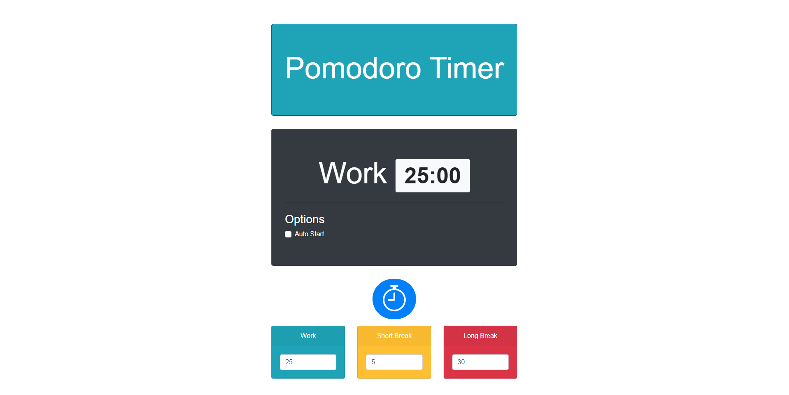
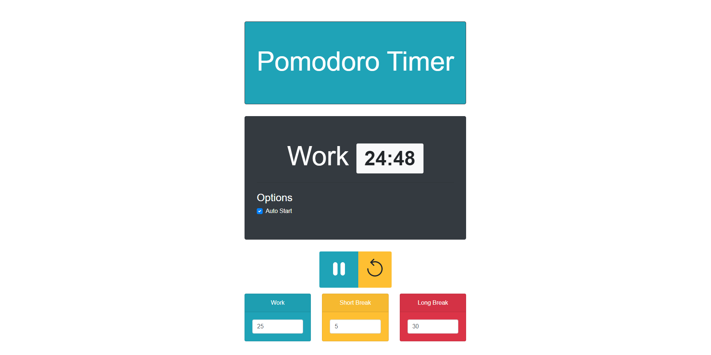
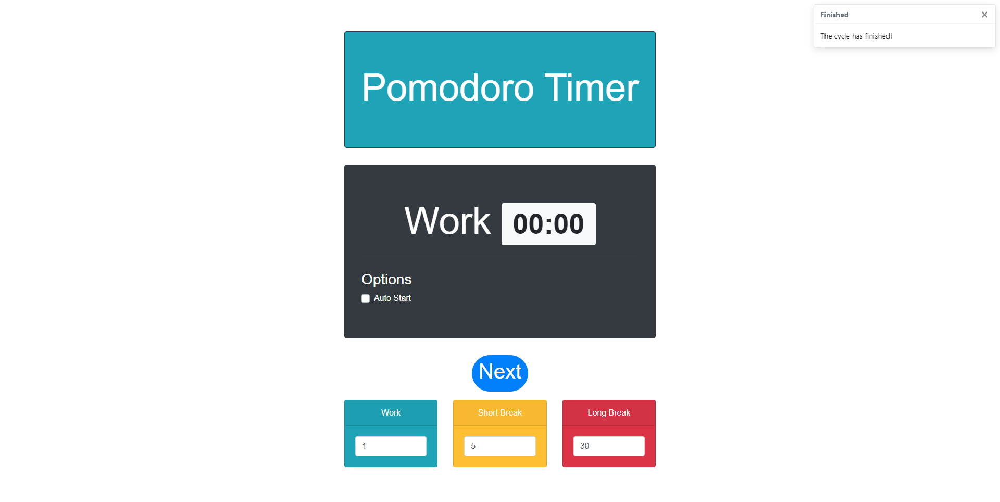

# Project-Pomodoro
A simple implementation of a [Pomodoro Timer](https://en.wikipedia.org/wiki/Pomodoro_Technique) using Vue.js.
## Snapshots

### Start Page


### Start Page With Different Time Setting


### Running


### End Of A Cycle


## Installation

### Download project

Clone this repository


### Project setup
```
yarn install
```

### Compiles and hot-reloads for development
```
yarn serve
```

### Compiles and minifies for production
```
yarn build
```

### Lints and fixes files
```
yarn lint
```